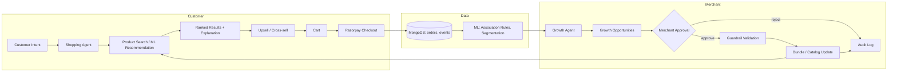

# ShopPilot AI

**Autonomous AI Commerce & Merchant Growth Platform**
Built for the Razorpay AI Builder Internship / Buildathon — Track 01: AI Growth & Agentic Commerce.

> AI should not merely recommend products. It should understand intent, use commerce tools,
> execute bounded actions, and create measurable business outcomes.

---

## 1. Problem Statement

Online stores treat discovery and growth as separate problems: a search box for customers,
a spreadsheet of dashboards for merchants. Neither side learns from the other. ShopPilot AI
closes the loop — a customer's shopping intent feeds a recommendation engine, purchases feed
a growth-analysis engine, and merchant-approved growth actions (bundles, cross-sells) feed
straight back into what the shopping agent can offer the next customer.

## 2. Solution

Two cooperating AI agents sit on top of one shared product/order dataset:

- **Customer Shopping Agent** — parses natural-language shopping intent, searches and ranks
  the catalog, explains its recommendations, and offers contextual upsell/cross-sell —
  ending in a real Razorpay Test Mode checkout.
- **Merchant Growth Agent** — mines the same order history for association rules and
  customer segments, turns them into scored, explainable growth opportunities (bundles,
  upsells), and only ever *proposes* — a human merchant must approve before anything is
  written back to the catalog. Every action is guardrailed server-side and audit-logged.

## 3. Architecture



**Backend:** FastAPI + Motor (async MongoDB) + scikit-learn/mlxtend for ML + Razorpay SDK.
**Frontend:** React + TypeScript + Vite + Tailwind CSS v4 + TanStack Query + Recharts.
**AI layer:** provider-independent `LLMProvider` abstraction with a deterministic
keyword/regex fallback — the whole app runs and demos correctly with zero API keys.

## 4. Features

### Customer
- Natural-language AI shopping assistant (`/shop`) — intent parsing, ranked results,
  "why this was recommended," contextual cross-sell.
- Product detail pages with "frequently bought together" (from real association rules).
- Functional cart, Razorpay Test Mode checkout (with a deterministic mock-payment fallback
  when no Razorpay keys are configured), order history.

### Merchant (`/merchant/*`)
- Overview: revenue, orders, conversion, AOV, AI-attributed revenue, live revenue chart.
- Analytics: category revenue, top/low-conversion products, KMeans customer segments.
- Growth Opportunities: AI-scored bundle/upsell opportunities with support/confidence/lift,
  expected uplift, and one-click Approve/Reject.
- AI Growth Copilot: chat interface, answers grounded in real aggregate data.
- Audit Trail: every AI action (proposal, approval, guardrail clamp, bundle creation) logged.
- Settings: merchant-configurable guardrails (max discount, max bundle discount, automation
  toggles) — enforced **server-side**, not just in the UI.

## 5. AI Agents

Both agents use an explicit tool registry — never arbitrary code execution:

- **Shopping Agent** (`backend/app/agents/shopping_agent.py`): `search_catalog`,
  `get_recommendations`, `get_cross_sell_products`, `add_to_cart`, `get_cart`. Cart mutation
  only happens on explicit customer action; payment is a separate, explicit step.
- **Growth Agent** (`backend/app/agents/growth_agent.py`): `get_revenue_metrics`,
  `get_product_metrics`, `get_association_rules`, `get_customer_segments`,
  `find_growth_opportunities`. Never writes to the catalog directly — every action requires
  merchant approval (`POST /api/opportunities/{id}/approve`) and is re-validated against
  server-side guardrails (`backend/app/services/guardrails.py`) regardless of what the AI
  proposed.

## 6. ML Models

| Model | File | Technique |
|---|---|---|
| Product recommendation | `app/ml/recommendation.py` | TF-IDF + cosine similarity, blended with popularity |
| Association rules | `app/ml/association.py` | Apriori (mlxtend) over order line-items → support/confidence/lift |
| Customer segmentation | `app/ml/segmentation.py` | KMeans over RFM features, deterministic segment naming |
| Growth opportunity scoring | `app/ml/opportunity.py` | Weighted score: `0.35·affinity + 0.25·conversion + 0.20·revenue + 0.20·confidence` |

Run `backend/scripts/evaluate_ml.py` after seeding for real Precision@K / Recall@K / Hit Rate,
association-rule distributions, and silhouette score — all computed against the seeded dataset,
nothing fabricated.

## 7. Razorpay Integration

- Orders are created **server-side only** (`POST /api/payments/create-order`) — the secret key
  never reaches the frontend.
- Payment signatures are verified server-side (`POST /api/payments/verify`) using Razorpay's
  official signature verification.
- **No Razorpay keys configured?** The backend falls back to a deterministic mock order/payment
  flow (`mock: true` in the response) so the full checkout loop — including signature
  verification — still works for local demos. Just add real Test Mode keys to `.env` to switch
  to the live Razorpay Checkout widget.

## 8. Database Schema (MongoDB)

`products`, `customers`, `carts`, `orders`, `merchants`, `search_events`, `cart_events`,
`recommendation_events`, `growth_opportunities`, `bundles`, `audit_logs`, `agent_conversations`.
See `backend/app/database/connection.py` for indexes.

## 9. API Overview

```
Products        GET/POST/PUT/DELETE /api/products[/{id}]
Search          GET /api/search · POST /api/ai/search
Recommendations GET /api/recommendations/{id} · POST /api/recommendations/personalized
Cart            GET/POST/PUT/DELETE /api/cart[/items[/{id}]]
Orders          GET/POST /api/orders[/{id}]
Payments        POST /api/payments/create-order · POST /api/payments/verify
Shopping Agent  POST /api/agent/shop
Growth Agent    POST /api/agent/growth
Merchant        GET /api/merchant/overview · /analytics/{timeseries,categories,products,segments}
Opportunities   GET /api/opportunities · POST /api/opportunities/{id}/approve
Guardrails      GET/PUT /api/merchant/settings/guardrails
Audit           GET /api/audit
```

## 10. Setup

### Prerequisites
- Python 3.11+ , Node.js 18+, MongoDB (local or `docker run -p 27017:27017 mongo:7`)

### Backend
```bash
cd backend
python -m venv venv
./venv/Scripts/activate     # Windows: venv\Scripts\activate | macOS/Linux: source venv/bin/activate
pip install -r requirements.txt
cp ../.env.example ../.env  # then edit values as needed
python scripts/seed_data.py
uvicorn app.main:app --reload --port 8000
```

### Frontend
```bash
cd frontend
npm install
npm run dev   # http://localhost:5173, proxies /api to :8000
```

### Environment variables (`.env` at repo root)
```
MONGODB_URI=mongodb://localhost:27017
DATABASE_NAME=shoppilot
RAZORPAY_KEY_ID=            # leave blank to use mock-payment mode
RAZORPAY_KEY_SECRET=
LLM_API_KEY=                # leave blank to use deterministic fallback NLU
LLM_PROVIDER=none           # or "anthropic"
FRONTEND_URL=http://localhost:5173
BACKEND_URL=http://localhost:8000
```

## 11. Running Tests

```bash
cd backend
./venv/Scripts/python.exe -m pytest tests/ -v
```
Covers ML (recommendation ranking, association rules, opportunity scoring, segmentation),
guardrail clamping, and the LLM fallback/intent-parsing logic.

## 12. Demo Flow (matches the required end-to-end scenario)

**Customer:** `/shop` → ask *"I need wireless headphones under ₹4000 for gaming"* → AI
returns ranked matches with an explanation → add to cart → cross-sell suggestion appears →
`/cart` → `/checkout` → Pay with Razorpay (mock or live Test Mode) → `/orders` shows the
confirmed order.

**Merchant:** `/merchant` → revenue/orders reflect the new order → `/merchant/opportunities`
shows AI-discovered bundles (e.g. Camera + SD Card, Smartwatch + Strap) with support/
confidence/lift → ask the Copilot *"How can I increase revenue?"* → open an opportunity →
Approve → guardrails clamp the discount if needed → bundle is created → `/merchant/audit`
shows every step → the Shopping Agent immediately surfaces the new bundle as a cross-sell.

## 13. Limitations

- Authentication is a lightweight email-identify flow, not a full password/JWT system (kept
  intentionally minimal so the agentic-commerce flow stays the focus).
- The LLM fallback uses keyword/regex NLU; plugging in `LLM_PROVIDER=anthropic` with a real
  key upgrades intent understanding without any other code changes (see
  `backend/app/agents/llm_provider.py`).
- Product images are placeholder photos (`picsum.photos`), not real product photography.
- Growth opportunities are recomputed on demand (`refresh=true`) rather than on a background
  schedule.

## 14. Future Improvements

- Real LLM-driven multi-turn negotiation in the shopping agent (clarifying questions).
- Scheduled/streaming opportunity recalculation instead of on-demand refresh.
- Campaign automation (currently intentionally gated off by guardrails, P2 in the original spec).
- Multi-merchant support (the schema already carries `merchant_id` everywhere).
